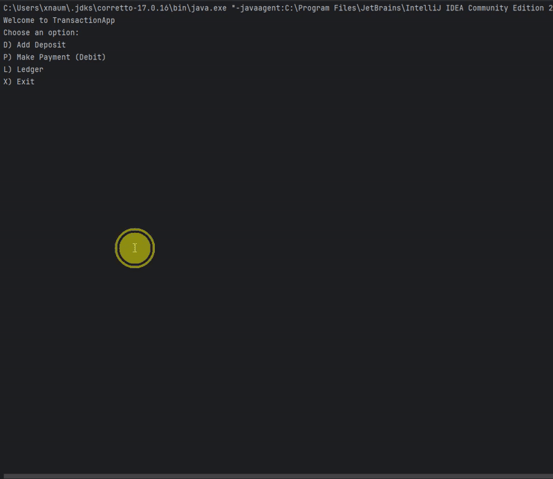
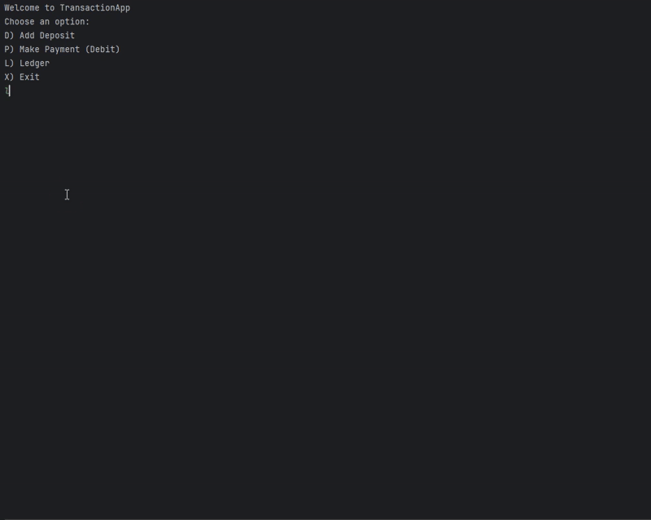

# Transaction App

## Description of the Project
This application allows you to get a good glance of all your transactions, while also allowing you to add any transaction you would like to. It also displays different reports in neat format.

## User Stories
- As a user, I want to add my deposit transactions so I can track my deposits.
- As a user, I want to add my payment transactions so I can track all payments I make.
- As a user, I want to be able to see all my transactions so I can better manage my money and understand what I’m spending it on.
- As a user I want to see only my deposits so I can better understand where my money is coming from.
- As a user I want to see only my payments so I can better understand where I am spending my money.
- As a user I want to see a report on my transactions from the current month to the current date so I can see my transactions for the month.
- As a user I want to see a report on my transactions from the past month only so I can see my transactions for the previous month.
- As a user, I want to see a report on my transactions from the previous year only so I can review my spending and income from last year.
- As a user I want to see a report on my transactions from the current year to current date so I can better see my incoming and outgoing money for the year.
- As a user, I want to search my transactions by vendor so I can view all payments or deposits from specific vendors.
- As a user I want to create my own filter for a report so it’s more flexible than the predefined reports.

## Setup

Follow the instructions below and run the project using IntelliJ IDEA.

### Prerequisites

- IntelliJ IDEA: Ensure you have IntelliJ IDEA installed, which you can download from [here](https://www.jetbrains.com/idea/download/).
- Java SDK: Make sure Java SDK is installed and configured in IntelliJ.

### Running the Application in IntelliJ

Follow these steps to get your application running within IntelliJ IDEA:

1. Open IntelliJ IDEA.
2. Select "Open" and navigate to the directory where you cloned or downloaded the project.
3. After the project opens, wait for IntelliJ to index the files and set up the project.
4. Find the main class with the `public static void main(String[] args)` method.
5. Right-click on the file and select 'Run 'YourMainClassName.main()'' to start the application.

## Technologies Used
- Java: `openjdk 17.0.12 2024-07-16`
## Demo

### Home Screen - Main Menu Navigation
*Adding deposits and payments to track financial transactions*

### Ledger Menu - View All Transactions
*Displaying all entries, deposits only, and payments only*

### Reports Menu - Pre-defined Financial Reports
*Viewing Date and Vendor Specific Reports*

### Custom Search - Flexible Filtering
*Filtering transactions by user applied filters*

## Future Work
- **Transaction Categories/Tags**: Allow users to categorize transactions (e.g., Groceries, Utilities, Entertainment, Savings) for better insights.
- **Batch Entry Mode**: Enable users to add multiple deposits or payments in succession without returning to the home screen after each entry.
- **Running Balance Tracking**: Display a running balance that updates with each transaction, allowing users to see insights about balance throughout months/years.
- **Total Values**: Show the total number of entries and amount (total deposited, total spent,etc..) for each report view to provide improved financial insights.
## Resources
- [Java Date Examples](https://www.studytonight.com/java-examples/)
- [Student Extra Resources Github](https://github.com/RayMaroun/students-extra-resources/blob/main/week3-payroll-tutorial.md)

## Thanks
- Thank you to Raymond for continuous support and guidance.
